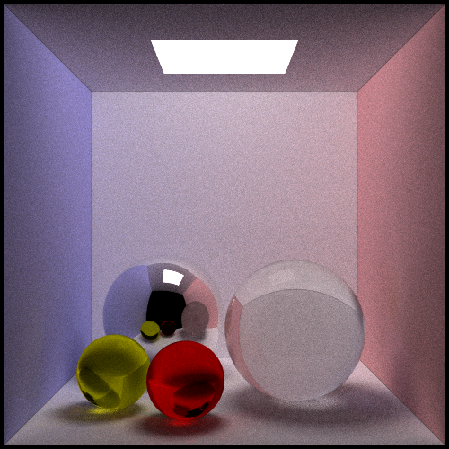
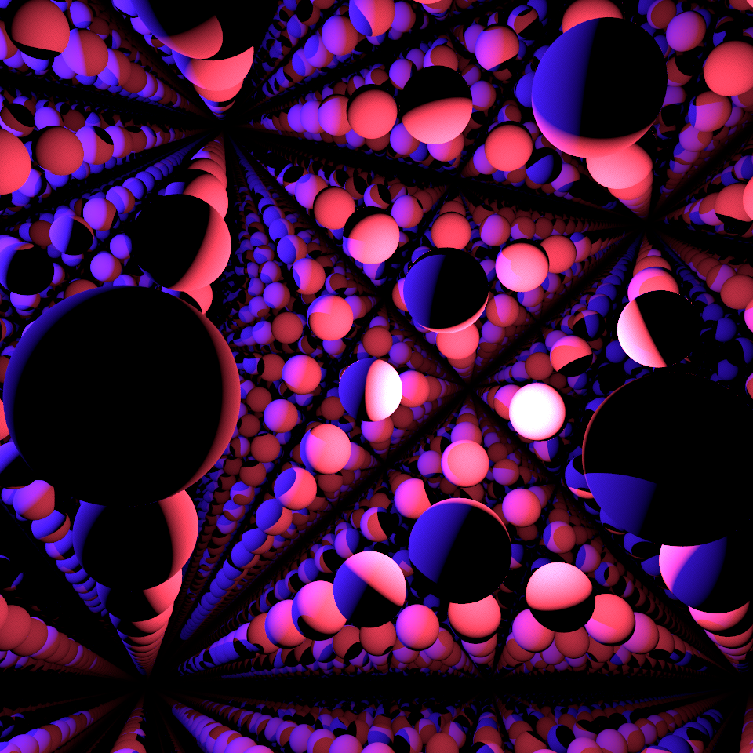
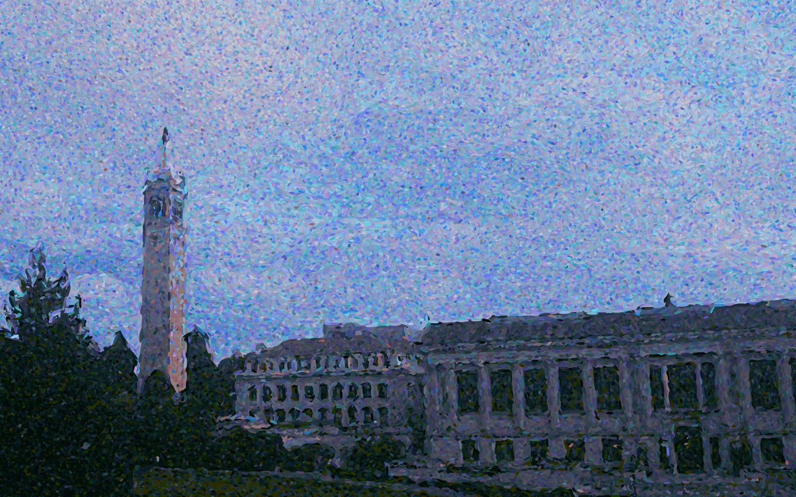

Here are some work samples releated to Computer Graphics I did before.

## Figure1

```{r figure1, echo=FALSE, out.width = "70%", fig.align = "center"}

```
<p>&nbsp;</p>
**Description:** This image was generated by a renderer using the path-tracing algorithm. The sample number for each pixel is 128, the max iteration for a ray was 8, and it took 16 hours to render (in one thread, and python is really slow compared to C++). 

\newpage
## Figure2

```{r figure3, echo=FALSE, out.width = "70%", fig.align = "center"}

```
<p>&nbsp;</p>
**Description:** This image is rendered using the program “pbrt-v3”, it was a homework of a rendering course I saw on the internet, and I tried to finish it. I implemented a new shape class in “pbrt-v3”, the ray-marching algorithm was used for calculating the intersection of rays and the shape. The idea of using signed distance functions to calculate intersections is truly a good example of combining math and applications together.

\newpage
## Figure3

```{r figure2, echo=FALSE, out.width = "90%", fig.align = "center"}

```
<p>&nbsp;</p>
**Description:** When I saw the painting “Evening Calm” by Paul Signac in the MET museum, I felt amazed that paintings can be drawn in that way, by putting colored dots together. I like this pointillism style and I want to do something similar using computers. The original photo was taken by myself at UC Berkeley, and I implemented an algorithm to turn it into the pointillism style. The algorithm used K-means to determine the color and image gradient to determine dots’ size and direction.